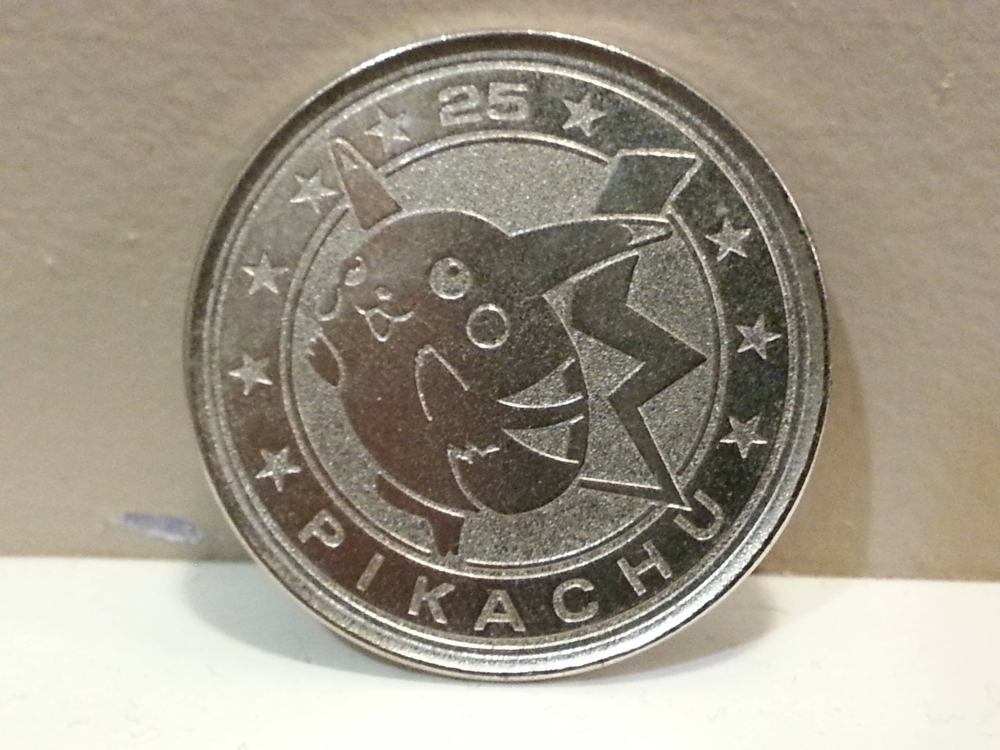

# ⛈️ Desafio DIO: NFT de Pokémon com Blockchain

  <!-- Contador de linguagens do GitHub -->
  
  <!-- Tamanho do repositório no GitHub -->
  
  <!-- Último commit no GitHub -->
  

  

## 🎯 Objetivo do Projeto
Este projeto cria e gerencia NFTs de Pokémon utilizando tecnologia blockchain. O desafio envolve implementar um token ERC-721 para representar os Pokémons e oferecer funcionalidades como batalhas e transferências de NFTs entre contas.

## 🛠 Tecnologias Empregadas
- **[Solidity](https://soliditylang.org/)**: Linguagem de programação para contratos inteligentes.
- **[Ganache](https://www.trufflesuite.com/ganache)**: Ferramenta para criar uma blockchain local para testar contratos inteligentes.
- **[Remix IDE](https://remix.ethereum.org/)**: Ambiente integrado para criar, testar e implantar contratos inteligentes na Ethereum.
- **[MetaMask](https://metamask.io/)**: Carteira de criptomoedas para interagir com a blockchain e contratos inteligentes.
- **[IPFS](https://ipfs.io/)**: Sistema de arquivos distribuído para armazenar e compartilhar dados, como imagens dos Pokémons.

## 🔍 Funcionalidades
- **Criação de NFTs**: Cria novos Pokémons como NFTs utilizando a função `createNewPokemon`.
- **Batalhas entre Pokémons**: Permite batalhas entre Pokémons com cooldown utilizando a função `battle`.
- **Evolução de Pokémons**: Evolui um Pokémon quando atinge um nível específico com a função `evolvePokemon`.
- **Transferência de NFTs**: Habilita a transferência de NFTs entre diferentes contas.

## 📜 Contrato PokeDIO
- **Nome do Token**: `PokeDIO`
- **Símbolo do Token**: `PKD`

### Estrutura do Contrato
O contrato `PokeDIO` é baseado no padrão ERC-721 da OpenZeppelin e inclui:
- **Estrutura `Pokemon`**: Armazena o nome, nível e imagem do Pokémon.
- **Função `createNewPokemon`**: Cria um novo Pokémon e minta um token ERC-721 para ele.
- **Função `battle`**: Realiza batalhas entre Pokémons com cooldown para evitar batalhas consecutivas.
- **Função `evolvePokemon`**: Permite a evolução de um Pokémon quando atinge o nível necessário.

## 📋 Guia de Implementação
1. **Configuração do Ambiente**
   - **Ganache**: Crie uma rede local Ethereum para testar o contrato.
   - **MetaMask**: Conecte-se à rede do Ganache para interagir com a blockchain.
   - **Remix IDE**: Acesse [remix.ethereum](https://remix.ethereum.org) para compilar e implantar o contrato.

2. **Implementação do Contrato**
   - Insira e compile o contrato `PokeDIO` no Remix IDE.
   - Teste as funcionalidades como criação de Pokémons, batalhas e evolução.
   - Conecte o MetaMask à blockchain local para realizar transações.

3. **Interação com o Contrato**
   - Use Remix IDE ou MetaMask para interagir e realizar operações de teste com o contrato.

## 💪 Contribuição
Contribuições são bem-vindas! Sinta-se à vontade para abrir issues ou fazer um fork do repositório e enviar pull requests.
1. Faça um fork do projeto.
2. Crie uma nova branch para sua feature: `git checkout -b feature/nome-feature`.
3. Commit suas mudanças: `git commit -m 'Adiciona nova feature'`.
4. Envie para a branch: `git push origin feature/nome-feature`.
5. Abra um Pull Request.

## 📝 Nota
Este projeto é para fins educacionais, feito para o desafio da **DIO**. Sinta-se livre para explorar e adaptar.
